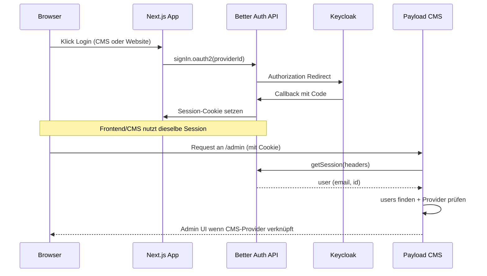

# Keycloak-Login mit Payload CMS (Better Auth)

Dieses Dokument beschreibt ein **Muster** für **Anmeldung über Keycloak** mit **Payload CMS** und **Next.js**. Ziel ist, es in eigenen Projekten nachzubauen.

## Kurzüberblick

- **Better Auth** (`better-auth`) übernimmt OAuth2/OIDC gegen Keycloak und speichert Sessions und verknüpfte Accounts in **derselben MongoDB** wie Payload (Better Auth nutzt einen eigenen Adapter auf die DB).
- **Payload** nutzt **kein** klassisches Passwort-Login für Admin-Benutzer: `disableLocalStrategy: true` und eine **eigene Auth-Strategy**, die die Better-Auth-Session aus Request-Headern liest und sie auf ein Payload-`users`-Dokument abbildet.
- Es gibt **zwei Keycloak-Clients** im **gleichen Realm**: einen für das **CMS** (`keycloak-cms` / Client z. B. `payload-cms`) und einen für die **Website** (`keycloak-ui` / Client z. B. `payload-ui`). So lassen sich Berechtigungen und Redirect-URIs sauber trennen.

## Architekturdiagramm (logisch)



## Bausteine (konzeptionell)

Typischerweise brauchst du zusätzlich: **Better Auth Server-Konfiguration** (Keycloak-Plugins, DB-Adapter), **Payload Auth-Strategy**, **Users-Collection** mit `auth.strategies`, **Route Handler** für `auth.handler`, optional eine **Redirect-Route** für OAuth-Callbacks.

Die folgenden **eingebetteten Module und Komponenten** stammen aus dem Referenzprojekt. Importe mit `@/` setzen ein TypeScript-Pfadalias voraus (oder Pfade anpassen). `FrontendAuthLinks` erwartet eine `Button`-Komponente unter `../ui/button` (z. B. shadcn) — Pfad bei Bedarf ändern.

### Better Auth Client (Browser + Provider-IDs)

```typescript
import { createAuthClient } from "better-auth/client";
import { genericOAuthClient } from "better-auth/client/plugins";

const baseURL =
  typeof window !== "undefined"
    ? ""
    : process.env.NEXT_PUBLIC_SERVER_URL || "http://localhost:3000";

export const authClient = createAuthClient({
  baseURL,
  plugins: [genericOAuthClient()],
});

export const KEYCLOAK_CMS_PROVIDER_ID = "keycloak-cms";
export const KEYCLOAK_UI_PROVIDER_ID = "keycloak-ui";
```

### Keycloak Logout-URL (Browser + Server)

```typescript
const KEYCLOAK_ISSUER =
  typeof window !== "undefined"
    ? (process.env.NEXT_PUBLIC_KEYCLOAK_ISSUER ?? "")
    : (process.env.KEYCLOAK_ISSUER ??
      process.env.NEXT_PUBLIC_KEYCLOAK_ISSUER ??
      "");

const END_SESSION_PATH = "/protocol/openid-connect/logout";

export function getKeycloakLogoutUrl(
  postLogoutRedirectUri: string,
): string | null {
  if (!KEYCLOAK_ISSUER) return null;
  const base = KEYCLOAK_ISSUER.replace(/\/$/, "");
  const url = new URL(END_SESSION_PATH, base);
  url.searchParams.set("post_logout_redirect_uri", postLogoutRedirectUri);
  return url.toString();
}
```

### Session in Server Components

`auth` ist die exportierte Better-Auth-Instanz der Server-Konfiguration (gleiche Datei wie `betterAuth(...)`).

```typescript
import { headers } from "next/headers";
import { auth } from "@/lib/auth";

export async function getBetterAuthSession() {
  const headersList = await headers();
  return auth.api.getSession({
    headers: headersList as unknown as Headers,
  });
}
```

### Payload Admin: `BeforeLogin` (Client Component)

In `payload.config.ts` unter `admin.components.beforeLogin` registrieren (Pfad zur Komponente).

```tsx
"use client";

import React from "react";
import { Button } from "@payloadcms/ui";
import { authClient, KEYCLOAK_CMS_PROVIDER_ID } from "@/lib/auth-client";

import "./index.scss";

const BeforeLogin: React.FC = () => {
  const handleKeycloakLogin = async () => {
    const result = await authClient.signIn.oauth2({
      providerId: KEYCLOAK_CMS_PROVIDER_ID,
      callbackURL: "/admin",
    });
    if (result?.data?.url) window.location.href = result.data.url;
  };

  return (
    <div className="before-login">
      <p className="before-login__text">
        Welcome to the CMS dashboard. Login to manage your website content.
      </p>
      <Button
        buttonStyle="primary"
        size="medium"
        type="button"
        onClick={handleKeycloakLogin}
      >
        Login
      </Button>
    </div>
  );
};

export default BeforeLogin;
```

### Styles für `BeforeLogin` (optional)

```scss
@import "~@payloadcms/ui/scss";

.before-login {
  text-align: center;

  &__text {
    margin: 0 0 base(1) 0;
    font-size: var(--base-body-size);
    line-height: 1.5;
    color: var(--theme-text);
  }

  .btn {
    margin-top: 0;
    margin-bottom: 0;
  }
}
```

### Website: `LoginForm` (Client Component)

```tsx
"use client";

import { Button } from "@/components/ui/button";
import { authClient, KEYCLOAK_UI_PROVIDER_ID } from "@/lib/auth-client";
import { Loader2 } from "lucide-react";
import React, { useState } from "react";

export function LoginForm({ callbackURL }: { callbackURL: string }) {
  const [loading, setLoading] = useState(false);

  const handleLogin = async () => {
    setLoading(true);
    try {
      const result = await authClient.signIn.oauth2({
        providerId: KEYCLOAK_UI_PROVIDER_ID,
        callbackURL,
      });
      if (result?.data?.url) window.location.href = result.data.url;
    } finally {
      setLoading(false);
    }
  };

  return (
    <Button
      className="h-11 w-full text-base"
      disabled={loading}
      onClick={handleLogin}
      size="lg"
      type="button"
    >
      {loading ? (
        <>
          <Loader2 aria-hidden className="size-5 animate-spin" />
          Redirecting…
        </>
      ) : (
        "Sign in"
      )}
    </Button>
  );
}
```

### Website: `FrontendAuthLinks` (Login / Logout im Header)

```tsx
"use client";

import React, { useState } from "react";
import Link from "next/link";
import { authClient } from "@/lib/auth-client";
import { getKeycloakLogoutUrl } from "@/utilities/keycloakLogoutUrl";
import { Button } from "../ui/button";

export function FrontendAuthLinks({ hasSession }: { hasSession: boolean }) {
  const [loggingOut, setLoggingOut] = useState(false);

  const handleLogout = async () => {
    setLoggingOut(true);
    await authClient.signOut();
    const origin = typeof window !== "undefined" ? window.location.origin : "";
    const postLogoutRedirectUri = `${origin}/`;
    const keycloakLogoutUrl = getKeycloakLogoutUrl(postLogoutRedirectUri);
    if (keycloakLogoutUrl) {
      window.location.href = keycloakLogoutUrl;
    } else {
      window.location.href = postLogoutRedirectUri;
    }
  };

  if (hasSession) {
    return (
      <Button onClick={handleLogout} disabled={loggingOut} variant="default">
        {loggingOut ? "Logging out…" : "Log out"}
      </Button>
    );
  }

  return (
    <Button asChild variant="default">
      <Link href="/login">Login</Link>
    </Button>
  );
}
```

### Payload Admin: `LogoutButton` (Custom Admin Logout)

In `payload.config.ts` unter `admin.components.logout.Button` registrieren.

```tsx
"use client";

import React from "react";
import { Button } from "@payloadcms/ui";
import { authClient } from "@/lib/auth-client";
import { getKeycloakLogoutUrl } from "@/utilities/keycloakLogoutUrl";

const DEFAULT_BUTTON_TEXT = "Log out";

type LogoutButtonProps = {
  buttonText?: string;
  onLogout?: () => void;
};

const LogoutButton: React.FC<LogoutButtonProps> = ({
  buttonText = DEFAULT_BUTTON_TEXT,
  onLogout,
}) => {
  const handleLogout = async () => {
    await authClient.signOut();
    onLogout?.();
    const origin = typeof window !== "undefined" ? window.location.origin : "";
    const postLogoutRedirectUri = `${origin}/admin/login`;
    const keycloakLogoutUrl = getKeycloakLogoutUrl(postLogoutRedirectUri);
    if (keycloakLogoutUrl) {
      window.location.href = keycloakLogoutUrl;
    } else {
      window.location.href = postLogoutRedirectUri;
    }
  };

  return (
    <Button type="button" onClick={handleLogout}>
      {buttonText}
    </Button>
  );
};

export default LogoutButton;
```

### Beispiel: Session an den Website-Header durchreichen (Server Component)

`HeaderClient` ist eure Client-Komponente für Navigation; dort `hasSession` an `FrontendAuthLinks` weitergeben.

```tsx
import { HeaderClient } from "./HeaderClient";
import { getBetterAuthSession } from "@/utilities/getBetterAuthSession";
import React from "react";

export async function Header() {
  const session = await getBetterAuthSession();

  return (
    <div className="border-b">
      <HeaderClient hasSession={Boolean(session?.user)} />
    </div>
  );
}
```

## Payload Auth-Strategy: `betterAuthStrategy`

Die Strategy verbindet **Payloads Auth-Pipeline** mit **Better Auth**. Sie wird in der Collection **`users`** unter `auth.strategies` registriert. Zusätzlich ist `disableLocalStrategy: true` gesetzt – es gibt also kein Payload-internes Passwort-Login; jede Admin-Anfrage mit Session wird über diese Strategy aufgelöst.

### Name und Rolle

- **`name: 'better-auth'`** – interner Strategy-Name in Payload.
- **`authenticate`** – wird von Payload aufgerufen, wenn für die `users`-Collection eine Session ermittelt werden soll (z. B. Admin-UI, `payload.auth`, Cookies im Request).

### Ablauf von `authenticate` (kurz)

1. **Session lesen:** `auth.api.getSession({ headers })` mit derselben `auth`-Instanz wie in der Better Auth Server-Konfiguration. Fehlt `session.user.email` → **`{ user: null }`** (nicht eingeloggt aus Payload-Sicht).
2. **Payload-User finden:** `payload.find` auf Collection `users` mit  
   `email` **gleich** Session-E-Mail **oder** `betterAuthUserId` **gleich** Better-Auth-User-`id`.  
   `overrideAccess: true`, `depth: 0`, `limit: 1` – die Strategy läuft ohne normale Collection-Access-Regeln, damit das Mapping zuverlässig klappt.
3. **Kein Auto-Provisioning:** Gibt es keinen Treffer oder keine `betterAuthId` → **`{ user }`** bzw. **`{ user: null }`**. Es wird **kein** neuer Payload-User aus Keycloak/Better Auth angelegt (Kommentar im Code: „Login only“).
4. **Provider-IDs ermitteln:** siehe nächster Unterabschnitt.
5. **Feld `realms` synchronisieren:** Wenn sich die Liste der Provider-IDs von dem unterscheidet, was in `user.realms` steht, wird ein **`payload.update`** auf denselben User ausgeführt (`realms` als Array von `{ providerId }`). Auch hier `overrideAccess: true`. Dient der **Transparenz im Admin** (welche OAuth-Provider sind verknüpft), nicht der Website-Access-Logik.
6. **CMS-Gate:** Zugriff auf das Payload-Admin **nur**, wenn unter den Provider-IDs **`keycloak-cms`** vorkommt (Konstante `KEYCLOAK_CMS_PROVIDER_ID`, muss exakt zum `providerId` der CMS-OAuth-Konfiguration in Better Auth passen). Sonst → **`{ user: null }`** – die Session existiert in Better Auth weiterhin, aber Payload behandelt die Person als nicht authentifiziert für Admin. So können dieselben Personen z. B. nur über `keycloak-ui` auf der Website eingeloggt sein, ohne CMS-Rechte.

Ergebnis bei Erfolg: **`{ user }`** mit dem Payload-User-Dokument (für `req.user` im Admin).

### Hilfsfunktion `getProviderIdsForBetterAuthUser`

Better Auth speichert pro verknüpftem OAuth-Provider Einträge in MongoDB (Account-Collection(s)). Die Strategy braucht die **`providerId`**-Werte (hier `keycloak-cms` / `keycloak-ui`), um Schritt 5 und 6 zu machen.

Die Implementierung:

- Öffnet eine **eigene** `MongoClient`-Verbindung mit `DATABASE_URL` (nicht über `req.payload` / Mongoose), listet Collections, deren Name **`account`** enthält (case-insensitive), und sucht in diesen Collections nach Dokumenten, die zum Better-Auth-User gehören.
- **Filter:** `userId` oder `user_id` gleich der stringhaften ID; falls die ID ein gültiges **ObjectId** ist, zusätzlich dieselben Felder mit **ObjectId**-Wert – Better Auth / Adapter können unterschiedliche Typen speichern.
- **Projection:** nur `providerId` / `provider_id` (camelCase und snake_case).
- Rückgabe: deduplizierte Liste aller gefundenen Provider-Strings.

Hinweis: Pro Admin-Request mit gültiger Session kann das **mehrere DB-Roundtrips** bedeuten (Session + User find + optional update + Mongo-Account-Scan). Für sehr hohe Last könnte man später cachen oder die Account-Collection fest benennen, wenn das Schema von Better Auth stabil und bekannt ist.

### Wichtige Konstanten und Konsistenz

| Ort                               | Wert                                           | Bedeutung                                                                                  |
| --------------------------------- | ---------------------------------------------- | ------------------------------------------------------------------------------------------ |
| Better Auth Server (OAuth-Plugin) | `providerId: 'keycloak-cms'` / `'keycloak-ui'` | OAuth-Provider-IDs                                                                         |
| Payload Strategy                  | `KEYCLOAK_CMS_PROVIDER_ID = 'keycloak-cms'`    | **Muss** zum CMS-`providerId` in Better Auth passen, sonst schlägt das CMS-Gate immer fehl |
| Better Auth Client (Browser)      | dieselben Strings für CMS/UI                   | Für `signIn.oauth2` im Browser identisch zum Server                                        |

### Felder am Payload-User (Bezug zur Strategy)

- **`email`** – primäres Zuordnungskriterium zur Better-Auth-Session.
- **`betterAuthUserId`** – optionale stabile Zuordnung, wenn E-Mail sich ändern könnte (wird von der Strategy mit abgefragt).
- **`realms`** – read-only im Admin; wird von der Strategy bei Login **überschrieben/aktualisiert**, wenn sich die verknüpften OAuth-Provider ändern.

### Unterschied zur Website-Auth

Die Strategy wird für **Payload Admin / `payload.auth` mit User-Collection** genutzt. Die **öffentliche Website** nutzt dagegen oft nur **`getBetterAuthSession()`** und prüft `session?.user`, **ohne** das `keycloak-cms`-Gate – daher der Hinweis weiter unten bei „Website-Login“.

## Umgebungsvariablen

Wesentlich (Namen kannst du in deinem Projekt anpassen):

- **`KEYCLOAK_ISSUER`** – Realm-Issuer-URL (z. B. `https://auth.example.com/realms/meins`)
- **`NEXT_PUBLIC_KEYCLOAK_ISSUER`** – gleicher Wert für **clientseitigen** Logout-Redirect zur Keycloak-Logout-URL
- **`KEYCLOAK_CMS_CLIENT_ID` / `KEYCLOAK_CMS_CLIENT_SECRET`** – Keycloak-Client für Admin/CMS
- **`KEYCLOAK_UI_CLIENT_ID` / `KEYCLOAK_UI_CLIENT_SECRET`** – Keycloak-Client für die öffentliche Website
- **`NEXT_PUBLIC_SERVER_URL`** – öffentliche App-URL **ohne** trailing slash; daraus leitet Better Auth `baseURL` und die OAuth-`redirect_uri` ab
- Optional **`BETTER_AUTH_URL`** – überschreibt die Basis-URL für OAuth, falls sie von `NEXT_PUBLIC_SERVER_URL` abweichen soll
- **`DATABASE_URL`** – MongoDB; wird von Payload und Better Auth genutzt

## Keycloak-Konfiguration

1. **Zwei Confidential Clients** (oder je nach Sicherheitskonzept) im selben Realm anlegen.
2. **Valid redirect URIs** müssen **exakt** zu den URIs passieren, die die App an Keycloak sendet. Beispiel (angepasst an eure öffentliche URL):

   `{NEXT_PUBLIC_SERVER_URL}/api/auth/oauth2/callback/keycloak-cms`  
   `{NEXT_PUBLIC_SERVER_URL}/api/auth/oauth2/callback/keycloak-ui`

   Pfad enthält **`oauth2`** (`/api/auth/oauth2/callback/...`), **kein** trailing slash; Host/Protokoll müssen zur echten App-URL passieren. Tritt **„Invalid parameter: redirect_uri“** auf, stimmt meist die URI in Keycloak nicht **bytegenau** mit dem überein, was Better Auth sendet.

3. **Post logout redirect URIs** für Keycloak-Logout anlegen (z. B. Startseite für Website, `/admin/login` für CMS).

4. Optional: in Entwicklung einen Debug-Endpunkt bereitstellen, der die exakten Redirect-URIs aus den Umgebungsvariablen ausgibt (in Produktion deaktivieren).

## Ablauf: Website-Login (`keycloak-ui`)

1. Nutzer öffnet `/login`, startet `authClient.signIn.oauth2({ providerId: 'keycloak-ui', callbackURL })`.
2. Better Auth leitet zu Keycloak, danach zurück auf den OAuth2-Callback unter `/api/auth/...`.
3. Session liegt im Browser (Better Auth).
4. Geschützte Inhalte: z. B. Seiten mit `visibility === 'customer-only'` prüfen **`getBetterAuthSession()`** (oder gleichwertig) und redirecten bei fehlender Session nach `/login?redirect=...`.
5. Header zeigt Login/Logout über **`hasSession={Boolean(session?.user)}`**, wobei die Session serverseitig für die Header-Komponente gelesen wird.

Hinweis: Die **Website** prüft hier primär „gibt es eine Better-Auth-Session mit User“, nicht explizit den Provider `keycloak-ui`. Praktisch sollten Kundinnen nur über den UI-Client einloggen; wer das strikt erzwingen will, müsste die Session/Accounts serverseitig gegen `providerId` prüfen (analog zur CMS-Strategy).

## Ablauf: CMS-Login (`keycloak-cms`)

1. Payload Admin zeigt vor dem Login eine **eigene Komponente** (z. B. mit OAuth-Button) → `signIn.oauth2({ providerId: 'keycloak-cms', callbackURL: '/admin' })`.
2. Nach erfolgreichem OAuth hat Better Auth eine Session (Cookie).
3. Jeder folgende Request ins Admin triggert **`betterAuthStrategy.authenticate`** – Ablauf, Provider-Scan, `realms`-Sync und CMS-Gate sind im Abschnitt **„Payload Auth-Strategy: betterAuthStrategy“** beschrieben.

## Logout

- Zuerst **`authClient.signOut()`** (Better-Auth-Session im Browser beenden).
- Anschließend optional Redirect zu Keycloak **`/protocol/openid-connect/logout`** mit `post_logout_redirect_uri`, gebaut in **`getKeycloakLogoutUrl`** (Issuer + `NEXT_PUBLIC_KEYCLOAK_ISSUER`).

## Replikation auf eine andere Website

1. **Better Auth** mit `genericOAuth` und zwei `keycloak({ issuer, clientId, clientSecret })`-Konfigurationen; jeweils eigener **`providerId`** und **`redirectURI`** unter `/api/auth/oauth2/callback/<providerId>`.
2. **Next.js Route Handler** für `auth.handler` unter dem von Better Auth konfigurierten **`basePath`** (hier `/api/auth`).
3. **Payload `Users`** mit `auth.disableLocalStrategy: true` und **`strategies: [betterAuthStrategy]`** (oder angepasste Kopie der Strategy).
4. **Keycloak**-Clients und Redirect-URIs für jede Deployment-URL pflegen.
5. **User-Mapping** klären: E-Mail und/oder `betterAuthUserId` setzen; Provisioning nicht aus dem Login-Callback erwarten (aktuell bewusst „login only“).
6. **Frontend**: `createAuthClient` + `genericOAuthClient`; gleiche `providerId`-Strings wie auf dem Server.
7. **Trennung CMS vs. Site**: Immer noch zwei Clients empfehlen; CMS-Zugriff an `keycloak-cms` (oder eurem Äquivalent) in der Strategy koppeln.

## Abgrenzung: Was Payload hier _nicht_ macht

- Payload speichert **keine** Keycloak-Tokens als primäre Auth-Quelle; die Session kommt von **Better Auth**.
- **Local Strategy** ist abgeschaltet; es gibt keine Payload-eigenen Admin-Passwörter in der Standardkonfiguration.
- **Live Preview** nutzt weiterhin `payload.auth` mit Request-Headern – funktioniert in Kombination mit der Strategy, wenn die Cookies mitgesendet werden und der User die Preview-Bedingungen erfüllt.

---
