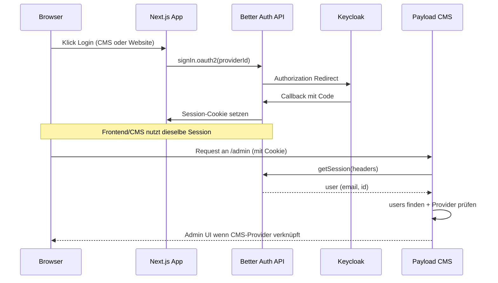

# Keycloak + Payload CMS + Better Auth (Next.js)

Wiederverwendbares **Muster** mit **kompakter Checkliste** (Schnellstart-Tabelle, `ORIGIN`, Redirects, Logout, Umgebungsvariablen, Sicherheit) und **ausführlicher** Anleitung: Architekturvarianten, Codebeispiele, Payload-Strategy und Abläufe.

## Praxis vor dem ersten Login

1. Schnellstart-Tabelle unten mit der echten **`ORIGIN`** durchgehen.
2. Falls vorhanden: **`GET /api/auth-redirect-uris`** (nur nicht-produktiv) — listet aus der aktuellen `.env` berechnete Callback-URLs; mit Keycloak **Valid redirect URIs** abgleichen.
3. **Valid post logout redirect URIs** in Keycloak mit dem Pfad abgleichen, den **Logout-Button** / Frontend wirklich als `post_logout_redirect_uri` sendet (z. B. nur `ORIGIN/admin` whitelisten, aber Code nutzt `ORIGIN/admin/login` → Abbruch).

---

## Schnellstart: Keycloak für eine neue Site / neue URL

Für **jede** öffentliche Basis-URL der App (lokal, Preview, Production) dieselben Schritte — nur `ORIGIN` austauschen.

| Schritt | Wo in Keycloak | Was eintragen |
|--------|----------------|----------------|
| 1 | Realm wählen | z. B. `northlight` — **Issuer** notieren: `https://<host>/realms/<realm>` |
| 2 | Client anlegen (confidential empfohlen) | Client-ID z. B. `brandportal-cms` oder `projektname-cms` |
| 3 | **Valid redirect URIs** | `ORIGIN/api/auth/oauth2/callback/<providerId>` — **exakt**, kein trailing slash auf dem Callback-Pfad |
| 4 | **Valid post logout redirect URIs** | Genau die URL, die die App als `post_logout_redirect_uri` sendet (z. B. `ORIGIN/admin`) |
| 5 | Web origins (falls gefragt) | `ORIGIN` oder `+` je nach Keycloak-Version / Policy |
| 6 | Client authentication | Für confidential: Secret generieren → in `.env` als `KEYCLOAK_*_CLIENT_SECRET` |
| 7 | App `.env` | `NEXT_PUBLIC_SERVER_URL` = **dieselbe** `ORIGIN` wie im Browser; `KEYCLOAK_ISSUER` = Issuer aus Schritt 1 |

**Wichtig**

- **`ORIGIN`** = Schema + Host + Port, **ohne** trailing slash, z. B. `http://localhost:3000` oder `https://preview.example.com`.
- **Nicht** mischen: einmal `localhost`, einmal `127.0.0.1` — sonst stimmen Cookies / Redirects nicht. Für lokale Tests entweder überall `localhost` oder überall `127.0.0.1` **und** dieselben URIs in Keycloak.
- **`providerId`** in Better Auth (Server + Client) muss **identisch** zum letzten Pfadsegment des Callbacks sein, z. B. Callback `…/callback/brandportal-cms` → `providerId: 'brandportal-cms'`.

---

## Zwei übliche Architektur-Varianten

| | **A — zwei Clients (CMS + Website), „Login only“** | **B — ein Client (CMS), Auto-Provisioning** |
|--|---------------------------------------------------|---------------------------------------------|
| Keycloak | CMS-Client + Website-Client, getrennte Redirects | Ein Client; Keycloak steuert, wer den Client nutzen darf |
| Payload-User | Kein Auto-Provision; Zuordnung über `users` + E-Mail / `betterAuthUserId` | Strategy kann `payload.create` nach OAuth |
| CMS-Zugriff | Nur bei verknüpftem Account + CMS-`providerId` (Mongo-Account-Scan) | Gültige Session mit CMS-`providerId`; ggf. `realms` nur Anzeige |
| Referenz | Rtbrick | Brandportal |

### Variante A — Zwei Keycloak-Clients (CMS + Website), „Login only“

- **CMS:** Client + `providerId` z. B. `keycloak-cms` — nur Nutzer mit diesem verknüpften Account dürfen ins Payload-Admin (Strategy prüft Accounts in Mongo).
- **Website:** zweiter Client + `providerId` z. B. `keycloak-ui`.
- Payload-User werden **nicht** automatisch angelegt; Zuordnung über bestehende `users`-Dokumente + E-Mail / `betterAuthUserId`.
- **`disableLocalStrategy: true`** ist hier typisch — kein Payload-Passwort-Login.
- Referenz: Projekt **Rtbrick**.

Der **Kurzüberblick**, das **Sequenzdiagramm** und die **Strategy-Beschreibung** weiter unten folgen primär dieser Variante.

### Variante B — Ein Keycloak-Client (nur CMS), Auto-Provisioning

- Ein Client (z. B. `brandportal-cms`), ein `providerId`.
- Nach erfolgreichem OAuth legt die **Payload-Strategy** bei Bedarf den `users`-Eintrag an (sofern nicht deaktiviert).
- Keycloak entscheidet, **wer** den Client nutzen darf.
- **Lokale Payload-Strategy** kann je nach Projekt **optional** bleiben oder abgeschaltet sein — nicht überall „hart“ `disableLocalStrategy: true` wie bei A; Felder und Defaults projektspezifisch.
- **Mongo-Scan** nach `account`-Collections ist bei einem Provider oft **nicht** nötig; CMS-Gate kann anders gelöst sein (z. B. nur gültige Session + Rollen).
- Referenz: **Brandportal** (dieses Repo-Muster).

---

## Technische Bausteine (gemeinsam)

- **Better Auth** mit `genericOAuth`, Sessions/Accounts in **derselben MongoDB** wie Payload (eigener Adapter).
- **Next.js:** Route `GET`/`POST` = `auth.handler` unter `basePath` `/api/auth` (ohne `nextCookies()`, wenn ihr Rtbrick/Brandportal-Verhalten wollt).
- **Payload:** `users` mit `auth.strategies: [betterAuthStrategy]`; lokales Passwort je nach Variante deaktiviert oder optional.
- **Client:** `createAuthClient` + `genericOAuthClient`; `providerId` wie auf dem Server.

---

## Logout-URL bauen (Realm-Pfad erhalten)

Der Issuer ist z. B. `https://keycloak.example.com/realms/meins`. Der Logout-Endpunkt liegt **unter dem Realm**, nicht unter dem Host-Root.

**Falsch** (Realm fällt weg — `new URL` mit Pfad, der mit `/` beginnt, ersetzt oft den Pfad am Host-Root):

```ts
new URL('/protocol/openid-connect/logout', issuer)
// wird zu https://keycloak.example.com/protocol/openid-connect/logout
```

**Richtig:** Issuer normalisieren, Pfad **anhängen**, und Keycloak erwartet üblicherweise **`client_id`** zusätzlich zu `post_logout_redirect_uri`:

```ts
const base = issuer.replace(/\/$/, '')
const url = new URL(`${base}/protocol/openid-connect/logout`)
url.searchParams.set('client_id', cmsClientId) // z. B. KEYCLOAK_CMS_CLIENT_ID
url.searchParams.set('post_logout_redirect_uri', postLogoutRedirectUri)
```

`post_logout_redirect_uri` muss **bytegenau** zu einer Eintragung unter **Valid post logout redirect URIs** im Keycloak-Client passen — z. B. `ORIGIN/admin`, nicht `…/admin/login`, wenn ihr nur `/admin` whitelistet (und umgekehrt).

---

## Kurzüberblick (Variante A, Rtbrick-orientiert)

- **Better Auth** (`better-auth`) übernimmt OAuth2/OIDC gegen Keycloak und speichert Sessions und verknüpfte Accounts in **derselben MongoDB** wie Payload (Better Auth nutzt einen eigenen Adapter auf die DB).
- **Payload** nutzt oft **kein** klassisches Passwort-Login für Admin: `disableLocalStrategy: true` und eine **eigene Auth-Strategy**, die die Better-Auth-Session aus Request-Headern liest und sie auf ein Payload-`users`-Dokument abbildet.
- Es gibt **zwei Keycloak-Clients** im **gleichen Realm**: **CMS** (`keycloak-cms` / Client z. B. `payload-cms`) und **Website** (`keycloak-ui` / Client z. B. `payload-ui`).

## Architekturdiagramm (logisch)



## Bausteine (konzeptionell)

Typischerweise brauchst du zusätzlich: **Better Auth Server-Konfiguration** (Keycloak-Plugins, DB-Adapter), **Payload Auth-Strategy**, **Users-Collection** mit `auth.strategies`, **Route Handler** für `auth.handler`, optional eine **Redirect-Route** für OAuth-Callbacks.

Die folgenden **eingebetteten Module und Komponenten** stammen aus dem Referenzprojekt. Importe mit `@/` setzen ein TypeScript-Pfadalias voraus (oder Pfade anpassen). `FrontendAuthLinks` erwartet eine `Button`-Komponente unter `../ui/button` (z. B. shadcn) — Pfad bei Bedarf ändern.

### Better Auth Client (Browser + Provider-IDs)

```typescript
import { createAuthClient } from "better-auth/client";
import { genericOAuthClient } from "better-auth/client/plugins";

const baseURL =
  typeof window !== "undefined"
    ? ""
    : process.env.NEXT_PUBLIC_SERVER_URL || "http://localhost:3000";

export const authClient = createAuthClient({
  baseURL,
  plugins: [genericOAuthClient()],
});

export const KEYCLOAK_CMS_PROVIDER_ID = "keycloak-cms";
export const KEYCLOAK_UI_PROVIDER_ID = "keycloak-ui";
```

### Keycloak Logout-URL (Browser + Server)

```typescript
const KEYCLOAK_ISSUER =
  typeof window !== "undefined"
    ? (process.env.NEXT_PUBLIC_KEYCLOAK_ISSUER ?? "")
    : (process.env.KEYCLOAK_ISSUER ??
      process.env.NEXT_PUBLIC_KEYCLOAK_ISSUER ??
      "");

/** Keycloak public client logout may omit secret; confidential clients need client_id. */
const KEYCLOAK_CMS_CLIENT_ID = process.env.NEXT_PUBLIC_KEYCLOAK_CMS_CLIENT_ID ?? process.env.KEYCLOAK_CMS_CLIENT_ID ?? "";

export function getKeycloakLogoutUrl(postLogoutRedirectUri: string): string | null {
  if (!KEYCLOAK_ISSUER) return null;
  const base = KEYCLOAK_ISSUER.replace(/\/$/, "");
  const url = new URL(`${base}/protocol/openid-connect/logout`);
  if (KEYCLOAK_CMS_CLIENT_ID) {
    url.searchParams.set("client_id", KEYCLOAK_CMS_CLIENT_ID);
  }
  url.searchParams.set("post_logout_redirect_uri", postLogoutRedirectUri);
  return url.toString();
}
```

Diese URL muss zu den in Keycloak eingetragenen **post logout**-URIs passen; den gleichen String wie in `postLogoutRedirectUri` auch dort whitelisten.

### Session in Server Components

`auth` ist die exportierte Better-Auth-Instanz der Server-Konfiguration (gleiche Datei wie `betterAuth(...)`).

```typescript
import { headers } from "next/headers";
import { auth } from "@/lib/auth";

export async function getBetterAuthSession() {
  const headersList = await headers();
  return auth.api.getSession({
    headers: headersList as unknown as Headers,
  });
}
```

### Payload Admin: `BeforeLogin` (Client Component)

In `payload.config.ts` unter `admin.components.beforeLogin` registrieren (Pfad zur Komponente).

```tsx
"use client";

import React from "react";
import { Button } from "@payloadcms/ui";
import { authClient, KEYCLOAK_CMS_PROVIDER_ID } from "@/lib/auth-client";

import "./index.scss";

const BeforeLogin: React.FC = () => {
  const handleKeycloakLogin = async () => {
    const result = await authClient.signIn.oauth2({
      providerId: KEYCLOAK_CMS_PROVIDER_ID,
      callbackURL: "/admin",
    });
    if (result?.data?.url) window.location.href = result.data.url;
  };

  return (
    <div className="before-login">
      <p className="before-login__text">
        Welcome to the CMS dashboard. Login to manage your website content.
      </p>
      <Button
        buttonStyle="primary"
        size="medium"
        type="button"
        onClick={handleKeycloakLogin}
      >
        Login
      </Button>
    </div>
  );
};

export default BeforeLogin;
```

### Styles für `BeforeLogin` (optional)

```scss
@import "~@payloadcms/ui/scss";

.before-login {
  text-align: center;

  &__text {
    margin: 0 0 base(1) 0;
    font-size: var(--base-body-size);
    line-height: 1.5;
    color: var(--theme-text);
  }

  .btn {
    margin-top: 0;
    margin-bottom: 0;
  }
}
```

### Website: `LoginForm` (Client Component)

```tsx
"use client";

import { Button } from "@/components/ui/button";
import { authClient, KEYCLOAK_UI_PROVIDER_ID } from "@/lib/auth-client";
import { Loader2 } from "lucide-react";
import React, { useState } from "react";

export function LoginForm({ callbackURL }: { callbackURL: string }) {
  const [loading, setLoading] = useState(false);

  const handleLogin = async () => {
    setLoading(true);
    try {
      const result = await authClient.signIn.oauth2({
        providerId: KEYCLOAK_UI_PROVIDER_ID,
        callbackURL,
      });
      if (result?.data?.url) window.location.href = result.data.url;
    } finally {
      setLoading(false);
    }
  };

  return (
    <Button
      className="h-11 w-full text-base"
      disabled={loading}
      onClick={handleLogin}
      size="lg"
      type="button"
    >
      {loading ? (
        <>
          <Loader2 aria-hidden className="size-5 animate-spin" />
          Redirecting…
        </>
      ) : (
        "Sign in"
      )}
    </Button>
  );
}
```

### Website: `FrontendAuthLinks` (Login / Logout im Header)

```tsx
"use client";

import React, { useState } from "react";
import Link from "next/link";
import { authClient } from "@/lib/auth-client";
import { getKeycloakLogoutUrl } from "@/utilities/keycloakLogoutUrl";
import { Button } from "../ui/button";

export function FrontendAuthLinks({ hasSession }: { hasSession: boolean }) {
  const [loggingOut, setLoggingOut] = useState(false);

  const handleLogout = async () => {
    setLoggingOut(true);
    await authClient.signOut();
    const origin = typeof window !== "undefined" ? window.location.origin : "";
    const postLogoutRedirectUri = `${origin}/`;
    const keycloakLogoutUrl = getKeycloakLogoutUrl(postLogoutRedirectUri);
    if (keycloakLogoutUrl) {
      window.location.href = keycloakLogoutUrl;
    } else {
      window.location.href = postLogoutRedirectUri;
    }
  };

  if (hasSession) {
    return (
      <Button onClick={handleLogout} disabled={loggingOut} variant="default">
        {loggingOut ? "Logging out…" : "Log out"}
      </Button>
    );
  }

  return (
    <Button asChild variant="default">
      <Link href="/login">Login</Link>
    </Button>
  );
}
```

### Payload Admin: `LogoutButton` (Custom Admin Logout)

In `payload.config.ts` unter `admin.components.logout.Button` registrieren. **`postLogoutRedirectUri` hier und in Keycloak identisch halten** (Pfad + Query).

```tsx
"use client";

import React from "react";
import { Button } from "@payloadcms/ui";
import { authClient } from "@/lib/auth-client";
import { getKeycloakLogoutUrl } from "@/utilities/keycloakLogoutUrl";

const DEFAULT_BUTTON_TEXT = "Log out";

type LogoutButtonProps = {
  buttonText?: string;
  onLogout?: () => void;
};

const LogoutButton: React.FC<LogoutButtonProps> = ({
  buttonText = DEFAULT_BUTTON_TEXT,
  onLogout,
}) => {
  const handleLogout = async () => {
    await authClient.signOut();
    onLogout?.();
    const origin = typeof window !== "undefined" ? window.location.origin : "";
    const postLogoutRedirectUri = `${origin}/admin/login`;
    const keycloakLogoutUrl = getKeycloakLogoutUrl(postLogoutRedirectUri);
    if (keycloakLogoutUrl) {
      window.location.href = keycloakLogoutUrl;
    } else {
      window.location.href = postLogoutRedirectUri;
    }
  };

  return (
    <Button type="button" onClick={handleLogout}>
      {buttonText}
    </Button>
  );
};

export default LogoutButton;
```

### Beispiel: Session an den Website-Header durchreichen (Server Component)

`HeaderClient` ist eure Client-Komponente für Navigation; dort `hasSession` an `FrontendAuthLinks` weitergeben.

```tsx
import { HeaderClient } from "./HeaderClient";
import { getBetterAuthSession } from "@/utilities/getBetterAuthSession";
import React from "react";

export async function Header() {
  const session = await getBetterAuthSession();

  return (
    <div className="border-b">
      <HeaderClient hasSession={Boolean(session?.user)} />
    </div>
  );
}
```

## Payload Auth-Strategy: `betterAuthStrategy`

Die Strategy verbindet **Payloads Auth-Pipeline** mit **Better Auth**. Sie wird in der Collection **`users`** unter `auth.strategies` registriert.

### Variante A vs. B (überblick)

| Thema | Variante A (Rtbrick) | Variante B (Brandportal) |
|--------|----------------------|---------------------------|
| Nach Login User fehlt | `{ user: null }` — kein Admin | Optional `payload.create` (Auto-Provision) |
| CMS-Zugriff | Nur wenn Mongo-Account CMS-`providerId` verknüpft | Gültige Session mit CMS-`providerId`-Flow; Realms-Feld ggf. nur Anzeige |
| Mongo-Scan nach `account`-Collections | Ja | Oft nein |
| `disableLocalStrategy` | Typisch `true` | Projektabhängig (optional / nicht überall „hart“) |

### Name und Rolle (Variante A im Detail)

- **`name: 'better-auth'`** — interner Strategy-Name in Payload.
- **`authenticate`** — wird von Payload aufgerufen, wenn für die `users`-Collection eine Session ermittelt werden soll (z. B. Admin-UI, `payload.auth`, Cookies im Request).

### Ablauf von `authenticate` (Variante A, kurz)

1. **Session lesen:** `auth.api.getSession({ headers })` mit derselben `auth`-Instanz wie in der Better Auth Server-Konfiguration. Fehlt `session.user.email` → **`{ user: null }`** (nicht eingeloggt aus Payload-Sicht).
2. **Payload-User finden:** `payload.find` auf Collection `users` mit  
   `email` **gleich** Session-E-Mail **oder** `betterAuthUserId` **gleich** Better-Auth-User-`id`.  
   `overrideAccess: true`, `depth: 0`, `limit: 1` — die Strategy läuft ohne normale Collection-Access-Regeln, damit das Mapping zuverlässig klappt.
3. **Kein Auto-Provisioning (A):** Gibt es keinen Treffer → **`{ user: null }`**. Es wird **kein** neuer Payload-User aus Keycloak/Better Auth angelegt („Login only“). In **Variante B** kann hier stattdessen `payload.create` erfolgen.
4. **Provider-IDs ermitteln:** siehe nächster Unterabschnitt (bei B ggf. vereinfacht oder entfallend).
5. **Feld `realms` synchronisieren:** Wenn sich die Liste der Provider-IDs von dem unterscheidet, was in `user.realms` steht, wird ein **`payload.update`** auf denselben User ausgeführt (`realms` als Array von `{ providerId }`). Auch hier `overrideAccess: true`. Dient der **Transparenz im Admin** (welche OAuth-Provider sind verknüpft), nicht zwingend der Website-Access-Logik.
6. **CMS-Gate (A):** Zugriff auf das Payload-Admin **nur**, wenn unter den Provider-IDs **`keycloak-cms`** vorkommt (Konstante `KEYCLOAK_CMS_PROVIDER_ID`, muss exakt zum `providerId` der CMS-OAuth-Konfiguration in Better Auth passen). Sonst → **`{ user: null }`** — die Session existiert in Better Auth weiterhin, aber Payload behandelt die Person als nicht authentifiziert für Admin.

Ergebnis bei Erfolg: **`{ user }`** mit dem Payload-User-Dokument (für `req.user` im Admin).

### Hilfsfunktion `getProviderIdsForBetterAuthUser` (vor allem Variante A)

Better Auth speichert pro verknüpftem OAuth-Provider Einträge in MongoDB (Account-Collection(s)). Die Strategy braucht die **`providerId`**-Werte (hier `keycloak-cms` / `keycloak-ui`), um Schritt 5 und 6 zu machen.

Die Implementierung:

- Öffnet eine **eigene** `MongoClient`-Verbindung mit **`DATABASE_URI`** (in manchen Templates `DATABASE_URL`; **dieselbe** DB wie Payload/Better Auth), listet Collections, deren Name **`account`** enthält (case-insensitive), und sucht in diesen Collections nach Dokumenten, die zum Better-Auth-User gehören.
- **Filter:** `userId` oder `user_id` gleich der stringhaften ID; falls die ID ein gültiges **ObjectId** ist, zusätzlich dieselben Felder mit **ObjectId**-Wert — Better Auth / Adapter können unterschiedliche Typen speichern.
- **Projection:** nur `providerId` / `provider_id` (camelCase und snake_case).
- Rückgabe: deduplizierte Liste aller gefundenen Provider-Strings.

Hinweis: Pro Admin-Request mit gültiger Session kann das **mehrere DB-Roundtrips** bedeuten (Session + User find + optional update + Mongo-Account-Scan). Für sehr hohe Last könnte man später cachen oder die Account-Collection fest benennen, wenn das Schema von Better Auth stabil und bekannt ist.

### Wichtige Konstanten und Konsistenz

| Ort                               | Wert                                           | Bedeutung                                                                                  |
| --------------------------------- | ---------------------------------------------- | ------------------------------------------------------------------------------------------ |
| Better Auth Server (OAuth-Plugin) | `providerId: 'keycloak-cms'` / `'keycloak-ui'` | OAuth-Provider-IDs                                                                         |
| Payload Strategy                  | `KEYCLOAK_CMS_PROVIDER_ID = 'keycloak-cms'`    | **Muss** zum CMS-`providerId` in Better Auth passen, sonst schlägt das CMS-Gate immer fehl |
| Better Auth Client (Browser)      | dieselben Strings für CMS/UI                   | Für `signIn.oauth2` im Browser identisch zum Server                                        |

### Felder am Payload-User (Bezug zur Strategy)

- **`email`** — primäres Zuordnungskriterium zur Better-Auth-Session.
- **`betterAuthUserId`** — optionale stabile Zuordnung, wenn E-Mail sich ändern könnte (wird von der Strategy mit abgefragt).
- **`realms`** — read-only im Admin; wird von der Strategy bei Login **überschrieben/aktualisiert**, wenn sich die verknüpften OAuth-Provider ändern.

### Unterschied zur Website-Auth

Die Strategy wird für **Payload Admin / `payload.auth` mit User-Collection** genutzt. Die **öffentliche Website** nutzt dagegen oft nur **`getBetterAuthSession()`** und prüft `session?.user`, **ohne** das `keycloak-cms`-Gate — daher der Hinweis weiter unten bei „Website-Login“.

## Umgebungsvariablen

| Variable | Zweck |
|----------|--------|
| `NEXT_PUBLIC_SERVER_URL` | Öffentliche App-URL, **ohne** trailing slash; primär für Better Auth `baseURL` + Browser-Client (Server-Teil) |
| `BETTER_AUTH_URL` | Optional, nur wenn OAuth-Basis von `NEXT_PUBLIC_SERVER_URL` abweichen soll |
| `KEYCLOAK_ISSUER` | Realm-Issuer (Server) |
| `NEXT_PUBLIC_KEYCLOAK_ISSUER` | Gleicher Issuer für **Browser** (Logout-Link) |
| `KEYCLOAK_CMS_CLIENT_ID` / `KEYCLOAK_CMS_CLIENT_SECRET` | Keycloak-Client für CMS; Client-ID oft auch für Logout-`client_id` nötig (öffentlich als `NEXT_PUBLIC_…` nur wenn ihr sie im Client exponieren wollt) |
| `KEYCLOAK_UI_CLIENT_ID` / `KEYCLOAK_UI_CLIENT_SECRET` | Keycloak-Client für die öffentliche Website (Variante A) |
| `KEYCLOAK_AUTH_SERVER_URL` + `KEYCLOAK_REALM` | Alternative zu `KEYCLOAK_ISSUER` |
| `BETTER_AUTH_SECRET` | ≥ 32 Zeichen; ideal **getrennt** von `PAYLOAD_SECRET` |
| `DATABASE_URI` | MongoDB (Payload + Better Auth in Brandportal-orientierten Setups; andere Projekte nennen die Variable ggf. `DATABASE_URL`) |

Wenn Keycloaks Discovery-Dokument eine **andere Hostname** ausweist als ihr nutzt, könnt ihr in Better Auth **feste** `authorizationUrl` / `tokenUrl` / `userInfoUrl` unterhalb des gewünschten Issuers setzen (z. B. in `src/lib/auth.ts`).

## Keycloak-Konfiguration (Details)

Die **Schnellstart-Tabelle** oben ist die Quelle der Wahrheit für neue URLs. Ergänzend:

1. **Variante A:** zwei Confidential Clients im selben Realm; **Variante B:** ein CMS-Client.
2. **Valid redirect URIs** müssen **exakt** zu den URIs passieren, die die App sendet:  
   `ORIGIN/api/auth/oauth2/callback/<providerId>` — **kein** trailing slash auf dem Callback-Pfad. „Invalid parameter: redirect_uri“ → meist Byte-Mismatch mit Keycloak.
3. **Post logout redirect URIs** müssen zu den tatsächlichen `post_logout_redirect_uri`-Werten aus **Website-Logout** und **Admin-LogoutButton** passen (können unterschiedliche Einträge sein).
4. Debug: `GET /api/auth-redirect-uris` nur in nicht-produktiven Umgebungen.

## Ablauf: Website-Login (`keycloak-ui`, Variante A)

1. Nutzer öffnet `/login`, startet `authClient.signIn.oauth2({ providerId: 'keycloak-ui', callbackURL })`.
2. Better Auth leitet zu Keycloak, danach zurück auf den OAuth2-Callback unter `/api/auth/...`.
3. Session liegt im Browser (Better Auth).
4. Geschützte Inhalte: z. B. Seiten mit `visibility === 'customer-only'` prüfen **`getBetterAuthSession()`** (oder gleichwertig) und redirecten bei fehlender Session nach `/login?redirect=...`.
5. Header zeigt Login/Logout über **`hasSession={Boolean(session?.user)}`**, wobei die Session serverseitig für die Header-Komponente gelesen wird.

Hinweis: Die **Website** prüft hier primär „gibt es eine Better-Auth-Session mit User“, nicht explizit den Provider `keycloak-ui`. Praktisch sollten Kundinnen nur über den UI-Client einloggen; wer das strikt erzwingen will, müsste die Session/Accounts serverseitig gegen `providerId` prüfen (analog zur CMS-Strategy).

## Ablauf: CMS-Login (`keycloak-cms`)

1. Payload Admin zeigt vor dem Login eine **eigene Komponente** (z. B. mit OAuth-Button) → `signIn.oauth2({ providerId: 'keycloak-cms', callbackURL: '/admin' })`.
2. Nach erfolgreichem OAuth hat Better Auth eine Session (Cookie).
3. Jeder folgende Request ins Admin triggert **`betterAuthStrategy.authenticate`** — Ablauf, Provider-Scan, `realms`-Sync und CMS-Gate sind bei **Variante A** oben beschrieben; **Variante B** kann Auto-Provisioning und schlankeres Gating nutzen.

## Logout

- Zuerst **`authClient.signOut()`** (Better-Auth-Session im Browser beenden).
- Anschließend Redirect zu Keycloak **`…/protocol/openid-connect/logout`** mit **`client_id`** (falls erforderlich) und **`post_logout_redirect_uri`**, gebaut wie im Abschnitt **Logout-URL bauen** und in **`getKeycloakLogoutUrl`**.

## Replikation: Checkliste neues Projekt

1. Keycloak-Client(s) + **Redirect-URIs** + **Post-Logout-URIs** wie in der Schnellstart-Tabelle (`ORIGIN`, `providerId`).
2. `.env` setzen (`NEXT_PUBLIC_SERVER_URL` = tatsächliche Browser-URL; `DATABASE_URI` / gleichwertig).
3. Better Auth: `baseURL` / `trustedOrigins` passend zur Origin; `providerId` + Callback-Pfad konsistent.
4. Route `/api/auth/[...all]` → `auth.handler`.
5. Payload: Strategy + `Users`-Collection + `BeforeLogin` / `LogoutButton` registrieren; **Variante** A oder B und `disableLocalStrategy` bewusst wählen.
6. Einmal mit **Network-Tab** prüfen: OAuth-Callback-Request, Set-Cookie, nächster Request `/admin` mit `Cookie`-Header.

## Sicherheit (Kurz)

- Wer den CMS-Client in Keycloak nutzen darf = wer ins Admin kann (bei Variante B zusätzlich Payload-`access`/Rollen beachten).
- Redirect- und Post-Logout-URIs **eng** halten, keine großen Wildcards.
- `requireIssuerValidation` in Better Auth nach Möglichkeit aktivieren, wenn Issuer stabil ist.

## Abgrenzung

- Payload speichert keine Keycloak-Tokens als primäre Auth-Quelle; Session kommt von **Better Auth**.
- **Variante A:** Local Strategy ist oft abgeschaltet; **Variante B:** lokal optional.
- **Live Preview** funktioniert, wenn Cookies mit dem Request mitgehen und der User berechtigt ist.

---
